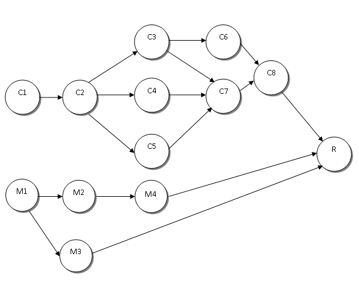

 

# chashi-lib

It is a topological sort library with optional event handler functionality. In Bengali, chashsi means farmer. According to the wikipedia, "A farmer is a person engaged in agriculture, raising living organism for food and raw material."   

This library is engaged to produce food (refined data) for the dedicated business environment. For example, a new college student may have multiple courses per semester. The student need to know which course needs pre-required courses to meet the requirement of degree. Therefore, a student needs to know the sorted order of courses. In this case, the student will produce a course graph and each course is a vertex and feed the graph data into this library. The library will return the sorted order of the courses. Now, the student can add event for each course, optionally. Like, when course A is sorted, trigger to fetch the syllabus of the course. In the complex scenario, course A and B are sorted but course C depends on course A and B. Therefore, course C's event (if event is registered) will be waiting until course A and B events' are completed.  

In short sentence, this library returns sorted vertexes of a graph. Event of the vertex will be triggered asynchronously, if event is registered.  

### How to use:  

Here is the user story. Bob recently passed the high school and now has been admitted at college XYZ in Computer Science department. He needs only 12 courses to complete the degree program from college XYZ.   

|Course Names | Vertex Names | Prerequisite	courses  						|
|------------ |:------------:|:---------------------------------------------|
| CS1         |    C1        |                                              |   
| CS2         |    C2        |                                              |   
| CS3         |    C3        | CS1, CS2                                     |
| CS4         |    C4        | CS1, CS2                                     |
| CS5         |    C5        | CS1, CS5,                                    |   
| CS6         |    C6        | CS1, CS2, CS3                                | 
| CS7         |    C7        | CS1, CS2, CS3, CS4, CS5                      |  
| CS8         |    C8        | CS1, CS2, CS3, CS6                           |
| Math1       |    M1        |                                              |  
| Math2       |    M2        | Math1                                        | 
| Math3       |    M3        | Math1                                        |
| Math4       |    M4        | Math1, Math2                                 |
| Final Report|    R         | All courses                                  | 

We can transform above table and prerequisite courses to the following acyclic graph.  

   
*Figure 1*

He wants to know which courses need to be completed first to complete his graduation. So, we can help him to get 
sorted order of the courses and fetch the syllabus of the courses asynchronously.

Therefore, each course is considered as vertex and edge provides the dependency connection among courses. No more talk we will jump to the code now:

1. At first we have to create GraphFactory object:  
<pre>
		// Create graph factory
		GraphFactory graphFactory = new GraphFactory();
</pre>

2. Based on the above table create the vertexes and registered sample callback function to fetch the syllabus:   
*Note: To simplicity purpose the callback is simple and will not fetch anything from online*  

<pre>
		// Create vertex for each courses and registered callback
		Vertex c1 = graphFactory.createVertex("C1");
		c1.registerCallBack(new CourseSyllabus("Introductory computer science"));

		Vertex c2 = graphFactory.createVertex("C2");
		c2.registerCallBack(new CourseSyllabus("Java 1"));

		Vertex c3 = graphFactory.createVertex("C3");
		c3.registerCallBack(new CourseSyllabus("Java 2"));

		Vertex c4 = graphFactory.createVertex("C4");
		c4.registerCallBack(new CourseSyllabus("Data Structure"));

		Vertex c5 = graphFactory.createVertex("C5");
		c5.registerCallBack(new CourseSyllabus("Algorithm"));

		Vertex c6 = graphFactory.createVertex("C6");
		c6.registerCallBack(new CourseSyllabus("Database System"));

		Vertex c7 = graphFactory.createVertex("C7");
		c7.registerCallBack(new CourseSyllabus("Software Engineering"));

		Vertex c8 = graphFactory.createVertex("C8");
		c8.registerCallBack(new CourseSyllabus("Design Pattern"));

		Vertex m1 = graphFactory.createVertex("M1");
		m1.registerCallBack(new CourseSyllabus("Linear Algebra"));

		Vertex m2 = graphFactory.createVertex("M2");
		m2.registerCallBack(new CourseSyllabus("Discreate Mathmatics"));

		Vertex m3 = graphFactory.createVertex("M3");
		m3.registerCallBack(new CourseSyllabus("Calculus"));

		Vertex m4 = graphFactory.createVertex("M4");
		m4.registerCallBack(new CourseSyllabus("Statistics"));

		Vertex r = graphFactory.createVertex("R");
		r.registerCallBack(new CourseSyllabus("Senior Report"));
</pre>

3. According to the figure 1, we will estabilish connection among vertexes:  
<pre>
		// Connect vertexes according to the above image of the graph
		VertexConnection vConn = graphFactory.createVertexConnection();
		vConn.from(c1).to(c2).connect();
		vConn.from(c2).to(c3, c4, c5).connect();
		vConn.from(c3).to(c6, c7).connect();
		vConn.from(c4).to(c7).connect();
		vConn.from(c5).to(c7).connect();
		vConn.from(c6).to(c8).connect();
		vConn.from(c7).to(c8).connect();
		vConn.from(c8).to(r).connect();
		vConn.from(m1).to(m2, m3).connect();
		vConn.from(m2).to(m4).connect();
		vConn.from(m3).to(r).connect();
		vConn.from(m4).to(r).connect();
</pre>

4. Print out the sorted vertexes:   

<pre>
		List<Vertex> sortedVertex = graphFactory.sort();
		for (Vertex v : sortedVertex)
			System.out.println(v.getVertexName());

</pre>

5. Final step, emits the registered event after sorting. event can be emitted only after sorting the vertex.  

<pre>
   // Emit the registered event asynchronously.
   graphFactory.emitEvent();
</pre>   

